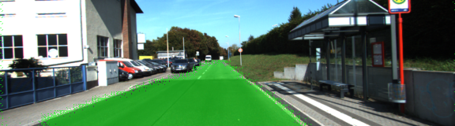
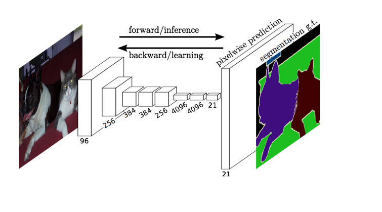
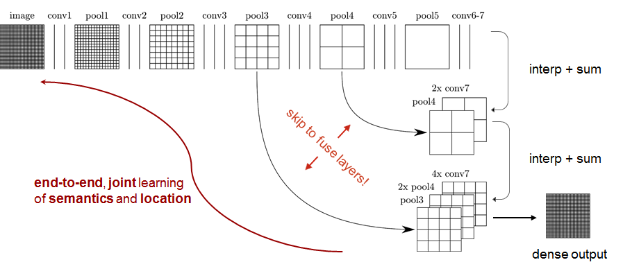
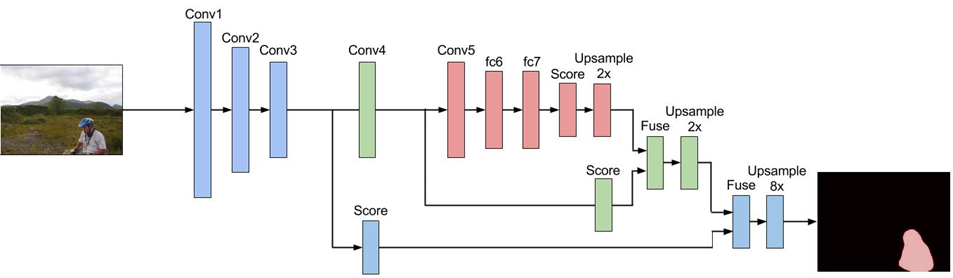
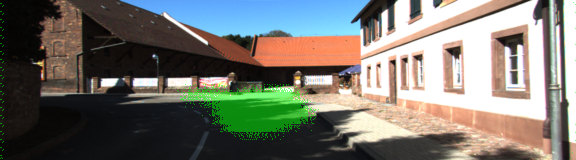
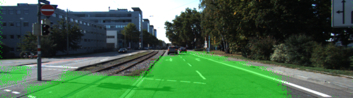
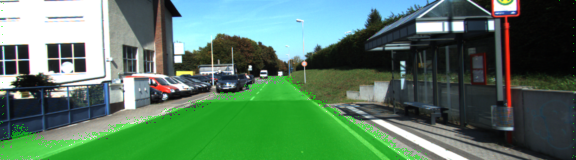
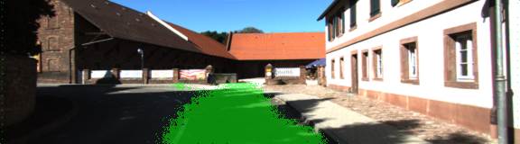
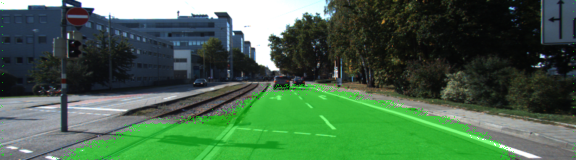
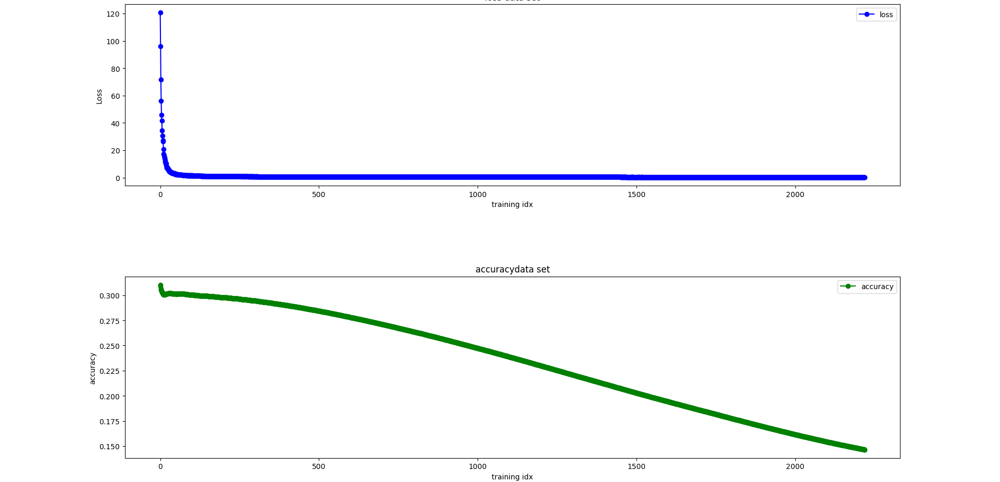

# Semantic Segmentation

[](http://www.udacity.com/drive)


# Project Goal 
---
* Implement a Fully Convolutional Network (FCN) and train the network
* Label the pixels of a road in images and a video using the trained  Fully Convolutional Network (FCN).
* Summarize the results with a written report


 *An image with lane lines annotated*


# Overview
---
The problem we are trying to solve in Semantic Segmentation is where in an image an object is (as opposed to if this is image of a specific thing that we do with CNNs).In this project we will identify objects at pixel level granularity.

The implementation is based on paper: [Fully Convolutional Networks for Semantic Segmentation](https://people.eecs.berkeley.edu/~jonlong/long_shelhamer_fcn.pdf)

The architecture of implementation of FCN is:



**Fully Convolutional Network (FCN)**  consists of 2 parts, Encoder and Decoder.

The **Encoder** is the CNN such as VGG or resnet or other networks trained for classification. CNNs typically have fully connected (Dense) layers followed by a softmax at the end of network. The CNNs "flatten" the network hence looses spatial information.

The **Decoder** consists of following parts:

1. 1x1 Convolution Layer: Instead of using fully connected layers in Encoder, they are replaced with 1x1 convolution, this preserves spatial information of objects. 
2. Upsampling (Transpose Convolution): The information in the FCN needs to be converted to size of the image that was input. Upsampling is done using transpose convolution operation to restore the output to size of original image.
3. Skip Connection: Skip connection helps more accurate end-to-end learning and avoids layers with weak weights or no learning (ResNet)


Combining the above elements, following architecture is used:



Here is how it is implemented:



Pretrained [VGG network](https://s3-us-west-1.amazonaws.com/udacity-selfdrivingcar/vgg.zip) is used as Encoder, Decoder including Upsampling and skip layer are implemented according to architecture mentioned in paper referred to earlier.

[Kitti Road dataset](https://s3-us-west-1.amazonaws.com/udacity-selfdrivingcar/advanced_deep_learning/data_road.zip) contains the training data with labeled images.


## Accuracy
Intersection over union operation is used to ascertain accuracy of the training step.

# Results
---
The hyper parameters to tune for this project were epochs,batch size and keep probability. 
The referred paper uses 175 epoch to train, However, in this project max epoch that the network is trained is 100, changing keep probability from 0.5 to 0.75 has slight impact of accuracy.


** Results with 0.5 as keep prob






** Results with 0.75 as keep prob






For Epoch=100 the loss reached is 0.06 and mean IoU (pixel is road)  at 0.85.



# Improvements and Enhancements

* The training set is small, use of data augmentation might help
* Suggestions about Inference performance is not implemented in this project, this will help improve training time.
* The man IoU accuracy is only 0.85, more training (data and epoch) might be needed


### Setup
##### GPU
`main.py` will check to make sure you are using GPU - if you don't have a GPU on your system, you can use AWS or another cloud computing platform.
##### Frameworks and Packages
Make sure you have the following is installed:
 - [Python 3](https://www.python.org/)
 - [TensorFlow](https://www.tensorflow.org/)
 - [NumPy](http://www.numpy.org/)
 - [SciPy](https://www.scipy.org/)
##### Dataset
Download the [Kitti Road dataset](http://www.cvlibs.net/datasets/kitti/eval_road.php) from [here](http://www.cvlibs.net/download.php?file=data_road.zip).  Extract the dataset in the `data` folder.  This will create the folder `data_road` with all the training a test images.

### Start
##### Implement
Implement the code in the `main.py` module indicated by the "TODO" comments.
The comments indicated with "OPTIONAL" tag are not required to complete.
##### Run
Run the following command to run the project:
```
python main.py
```
**Note** If running this in Jupyter Notebook system messages, such as those regarding test status, may appear in the terminal rather than the notebook.

### Submission
1. Ensure you've passed all the unit tests.
2. Ensure you pass all points on [the rubric](https://review.udacity.com/#!/rubrics/989/view).
3. Submit the following in a zip file.
 - `helper.py`
 - `main.py`
 - `project_tests.py`
 - Newest inference images from `runs` folder  (**all images from the most recent run**)
 
 ### Tips
- The link for the frozen `VGG16` model is hardcoded into `helper.py`.  The model can be found [here](https://s3-us-west-1.amazonaws.com/udacity-selfdrivingcar/vgg.zip)
- The model is not vanilla `VGG16`, but a fully convolutional version, which already contains the 1x1 convolutions to replace the fully connected layers. Please see this [forum post](https://discussions.udacity.com/t/here-is-some-advice-and-clarifications-about-the-semantic-segmentation-project/403100/8?u=subodh.malgonde) for more information.  A summary of additional points, follow. 
- The original FCN-8s was trained in stages. The authors later uploaded a version that was trained all at once to their GitHub repo.  The version in the GitHub repo has one important difference: The outputs of pooling layers 3 and 4 are scaled before they are fed into the 1x1 convolutions.  As a result, some students have found that the model learns much better with the scaling layers included. The model may not converge substantially faster, but may reach a higher IoU and accuracy. 
- When adding l2-regularization, setting a regularizer in the arguments of the `tf.layers` is not enough. Regularization loss terms must be manually added to your loss function. otherwise regularization is not implemented.
 
### Using GitHub and Creating Effective READMEs
If you are unfamiliar with GitHub , Udacity has a brief [GitHub tutorial](http://blog.udacity.com/2015/06/a-beginners-git-github-tutorial.html) to get you started. Udacity also provides a more detailed free [course on git and GitHub](https://www.udacity.com/course/how-to-use-git-and-github--ud775).

To learn about REAMDE files and Markdown, Udacity provides a free [course on READMEs](https://www.udacity.com/courses/ud777), as well. 

GitHub also provides a [tutorial](https://guides.github.com/features/mastering-markdown/) about creating Markdown files.
